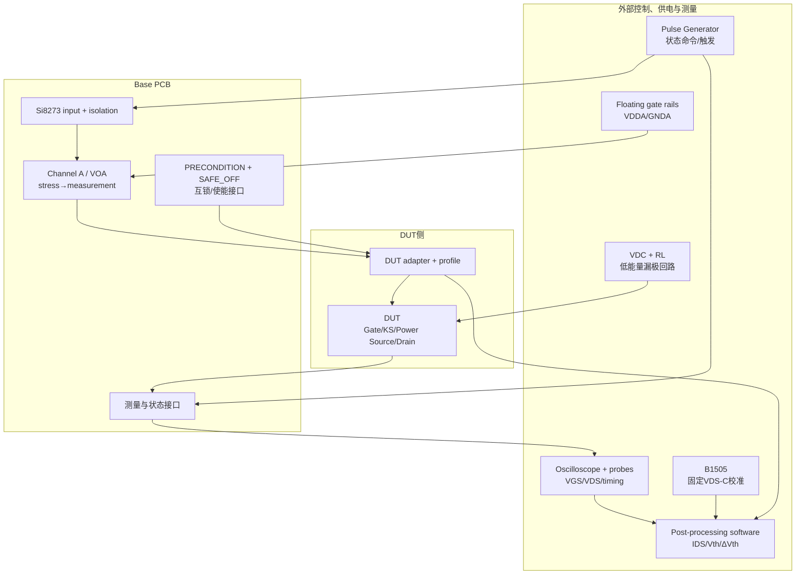
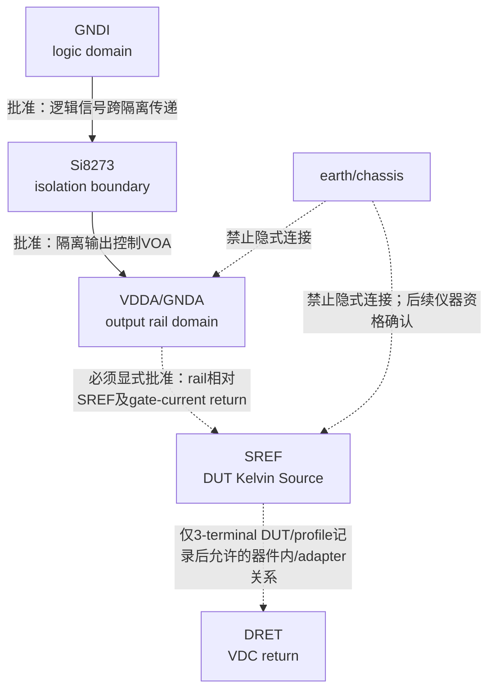
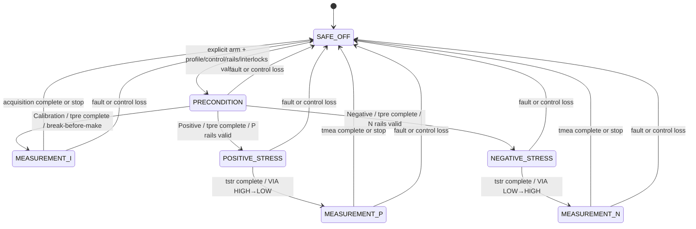
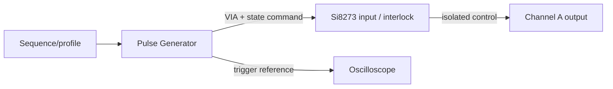
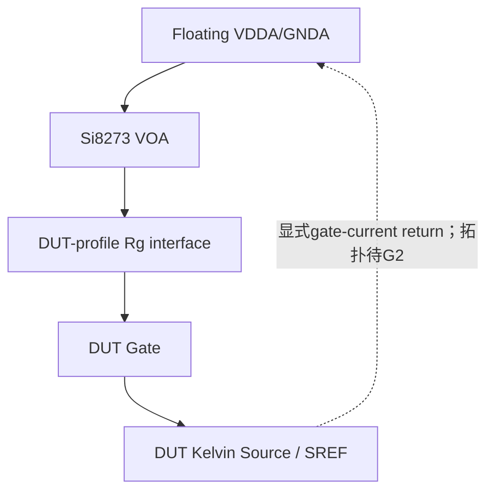
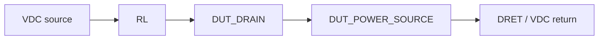
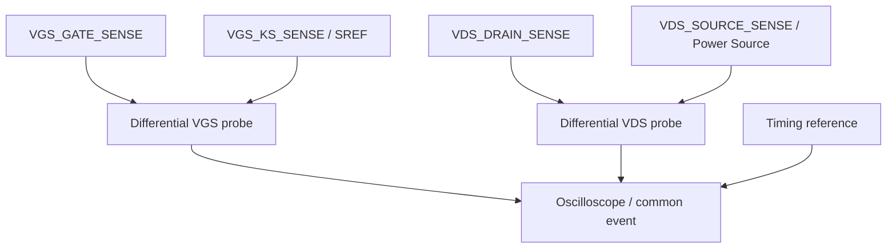
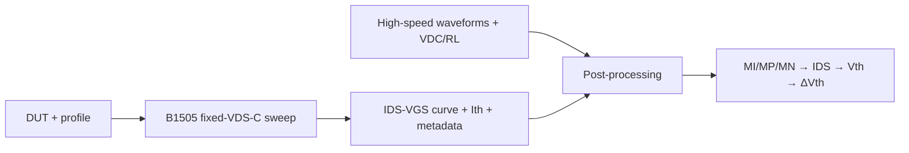

# SiC MOSFET BTI快速栅极驱动PCB / Fig. 3复现

## G1系统架构与接口候选基线

- 版本：`G1-SYS-ARCH-v1.0`
- 日期：2026-08-25
- 文件状态：**G1 RESOLUTION PROPOSED — READY FOR MASTER REVIEW**
- 上游基线：`docs/requirements.md`，65条`REQ-SYS-*`，状态`FROZEN`
- G0阶段门：`PASS`
- G1阶段：`READY FOR MASTER REVIEW`；不表示`PASS`或`FROZEN`
- G2：`NOT STARTED / 可准备datasheet和计算`
- G3：`BLOCKED`

## 1. 边界、术语与证据等级

本文件把冻结需求转换为系统模块、状态逻辑、接口和责任分配。它不修改任何`REQ-SYS-*`，不选择器件料号、数值、connector pin、0 V/保护拓扑，也不进入KiCad。

- `PROJECT REQUIREMENT`：直接继承冻结需求。
- `G1 ARCHITECTURE PROPOSAL`：本文件提出、等待Master审核的逻辑职责或接口。
- `DEFERRED`：数值或物理实现按指定Gate决定。
- `DUT profile`：受控配置档案；只在更换DUT或切换已批准profile时改变。
- `DRET`：G1提出的漏极功率回路返回域名称，即`VDC return`；不是`SREF`、`GNDA`或earth的别名。
- `VGS_SAFE`：符号化非应力安全栅极目标/允许带；具体电压、容差和实现延期至G2并在G10验证。

基线审核未发现必须修改冻结需求的矛盾，因此本轮未触发`BASELINE_CHANGE_REQUIRED`。

## 2. 完整系统模块方框图

### 图1：完整系统模块方框图

架构位置说明：Si8273隔离边界、`VOA`快速切换、PRECONDITION/SAFE_OFF逻辑接口和测量观察节点属于Base PCB；Pulse Generator、floating gate rails、`VDC/RL`、示波器/探头、B1505和软件均为外部系统；adapter与DUT属于DUT侧。具体器件和物理边界仍由后续Gate批准。

## 3. Reference domain定义与关系

### 3.1 域定义

| Domain | 定义 | 允许用途 | 不得默认解释为 |
|---|---|---|---|
| `GNDI` | Si8273逻辑输入侧参考 | `VIA`、逻辑侧供电、控制/触发接口参考 | `GNDA`、`SREF`、earth |
| `GNDA` | Si8273 channel A输出侧低电源轨 | 输出级低rail；其相对`SREF`电位由当前BTI profile定义 | `SREF`、earth、0 V |
| `VDDA` | Si8273 channel A输出侧高电源轨 | 输出级高rail；其相对`SREF`电位由当前BTI profile定义 | 固定正电压、earth |
| `SREF` | DUT Kelvin Source参考 | `VGS`驱动和`VGS`测量的唯一DUT侧参考 | `GNDA`、DUT Power Source return、earth |
| `DRET` | `VDC`漏极功率回路返回域 | `DUT_POWER_SOURCE→VDC return` | `SREF`、`GNDA`、earth |
| earth/chassis | 实验室保护地或仪器机壳参考 | 保护、屏蔽或仪器安全功能；连接须经资格确认 | 任一信号reference的默认节点 |

### 图2：Reference domain关系图

图中实线只表示已批准的功能/隔离信号关系，不表示参考节点短接；虚线表示必须显式决定或受控的关系。Isolation boundary位于`GNDI`域与Si8273 channel A输出域之间。

### 3.2 冻结rail关系：均相对`SREF`

Positive BTI：

- `V(VDDA)-V(SREF)=VGS-P`
- `V(GNDA)-V(SREF)=VGM-P`
- stress：`VIA=HIGH`
- measurement：`VIA=LOW`

Negative BTI：

- `V(VDDA)-V(SREF)=VGM-N`
- `V(GNDA)-V(SREF)=VGS-N`
- stress：`VIA=LOW`
- measurement：`VIA=HIGH`

上述仅是逻辑电压关系，不表示`GNDA=SREF`、`GNDA=earth`、`SREF=earth`，也不决定电源生成或回流拓扑。外部floating rails必须在G2给出一个显式、可审核、不会借用earth或Power Source回路的gate-current return实现；任何节点连接必须单独列入接口并获Master批准。

### 3.3 禁止的implicit connection及后果

| 禁止隐式连接 | 可能后果 |
|---|---|
| `GNDI↔GNDA` | 跨越隔离边界、形成控制地环路、破坏共模能力 |
| `GNDI↔SREF` | Pulse Generator地把DUT侧钳到未批准电位，导致短路或错误`VGS` |
| `GNDI↔earth/chassis`作为默认关系 | 通过仪器形成隐藏回路，隔离失效 |
| `GNDA↔SREF` | 把`VGM-P`或`VGS-N`错误强制为0 V，破坏P/N真值关系并可能短路rail |
| `GNDA↔earth/chassis` | 非浮地电源或探头造成rail短路、DUT应力错误 |
| `VDDA↔earth/chassis` | 高rail被机壳固定，可能造成电源争用或过压 |
| `SREF↔earth/chassis` | 产生危险接地电流、使`VGS`测量参考失真 |
| `SREF↔DRET`作为Base PCB默认关系 | Power Source压降/source bounce进入Kelvin测量；3-terminal例外必须写入profile |
| `GNDA↔DRET` | Gate回流与漏极功率回流混合，产生共阻抗误差和异常电流 |
| 差分探头负端被当成“无影响地” | 某些探头输入/机壳可能建立earth路径，造成上述任一隐式连接 |

## 4. 系统模块定义（13个）

| # | 模块 | 输入 | 输出 | Reference | 责任 | 不负责 | 故障行为逻辑目标 | 后续依赖 | 需求追溯 |
|---:|---|---|---|---|---|---|---|---|---|
| 1 | Pulse Generator / 外部控制 | profile、序列、`tpre/tstr/tmea/tdly`命令、interlock许可 | `VIA`、state command、trigger/timing reference、enable请求 | `GNDI`；触发接收端域需资格确认 | 产生可重复状态命令和共同时间参考；禁止未授权stress | 不产生gate rail、`VDC`或校准曲线 | 控制丢失/无效时撤销enable并请求`SAFE_OFF` | 电平/通道/jitter：G2；实测：G10/G11 | `REQ-SYS-FUNC-003/008`; `REQ-SYS-TIME-003...006`; `REQ-SYS-INTERFACE-005`; `REQ-SYS-SAFE-002` |
| 2 | Si8273逻辑输入与隔离边界 | `VIA`、`VDDI/GNDI` | 隔离后的channel A控制 | 输入`GNDI`，输出`VDDA/GNDA`域 | 保持逻辑/输出域隔离并传递channel A命令 | 不定义rail相对`SREF`的电位，不承担系统SAFE_OFF全部责任 | 输入无效或UVLO时不得产生未授权stress；实际默认输出待G2核对 | 精确料号、UVLO/default：G2；故障测试：G10 | `REQ-SYS-FUNC-007/008`; `REQ-SYS-INTERFACE-003/005`; `REQ-SYS-SAFE-002` |
| 3 | Si8273 channel A输出与stress→measurement切换 | 隔离控制、`VDDA/GNDA` | `VOA`两级输出 | `VDDA/GNDA`输出域；DUT目标相对`SREF` | 负责P/N stress→measurement关键快速转换 | 不负责0 V预处理、B1505、`VDC/RL`或算法 | rail/控制异常时禁止保持stress；请求/服从`SAFE_OFF` | 输出能力、动态、去耦、具体实现：G2；验证：G11 | `REQ-SYS-FUNC-006...008`; `REQ-SYS-TIME-001/002`; `REQ-SYS-VERIFY-001` |
| 4 | 外部floating gate rail模块 | profile、rail enable、外部供能 | `VDDA/GNDA`及受控reference/return关系 | 输出浮动域，目标相对`SREF` | 提供当前profile要求的两条rail并受控启停；保持浮地资格 | 不决定DUT值、不借用earth、不自动短接`GNDA/SREF` | 失配、欠压、非浮地或disable时撤销gate许可并请求`SAFE_OFF` | rail范围、限流、回路拓扑：G2；资格确认：G10 | `REQ-SYS-FUNC-002/008`; `REQ-SYS-INTERFACE-002/003/006`; `REQ-SYS-SAFE-002/004` |
| 5 | 0 V PRECONDITION功能模块 | state command、interlock、`SREF` | `V(DUT_GATE)-V(SREF)=0`功能目标 | `SREF` | 每条序列提供0 V预处理；与`VOA`互斥 | 不等同`SAFE_OFF`；不选择clamp/switch拓扑 | 控制异常时不得与`VOA`同时低阻驱动；转入`SAFE_OFF` | 拓扑/容差：G2；物理实现：G3/G6/G7；验证：G10/G12 | `REQ-SYS-FUNC-003`; `REQ-SYS-METHOD-001`; `REQ-SYS-INTERFACE-010`; `REQ-SYS-SAFE-003` |
| 6 | `SAFE_OFF`与安全控制 | fault、control-valid、UVLO、rail-valid、profile-valid、user arm | gate inhibit、drain disable、fault latch/status | 跨域逻辑；每个状态信号保持自身domain | 使gate进入`VGS_SAFE`非应力目标、撤销漏极能量、阻止自动重启 | 不把`VGS_SAFE`固定为0 V，不选择保护器件/阈值 | 任一强制事件进入并锁存；仅显式re-arm退出 | 具体阈值/拓扑：G2；故障验证：G10 | `REQ-SYS-SAFE-001...004`; `REQ-SYS-INTERFACE-005/010` |
| 7 | DUT Gate / Kelvin Source / Power Source接口 | `DUT_GATE`驱动、`VDC/RL`漏极回路 | Gate/KS/Power Source/Drain连接和sense节点 | Gate以`SREF`为参考；Power Source以`DRET`返回 | 保持Gate、Kelvin Source、Power Source职责分离 | 不把Power Source代替Kelvin Source，不定义封装pin | 接口缺失/错接时禁止arm与drain enable | pinout/机械：G4/G6；routing：G7 | `REQ-SYS-INTERFACE-001...004/007/009`; `REQ-SYS-DUT-004/005` |
| 8 | DUT adapter与DUT profile配置 | 已批准DUT/profile、Base PCB通用接口 | 封装适配、profile metadata、configuration-valid | `SREF`和`DRET`在adapter边界显式标识 | 吸收封装、KS存在性、`Rg`配置和DUT参数差异 | 同一DUT/profile的P/N切换中不得更换adapter或`Rg` | profile不匹配/adapter未验证时禁止arm | 电气参数：G2；pin/机械：G4/G6；routing：G7 | `REQ-SYS-FUNC-001/002`; `REQ-SYS-DUT-001...005`; `REQ-SYS-SAFE-004` |
| 9 | `VDC + RL`低`VDS`漏极负载回路 | `VDC`、`RL`、drain enable、DUT | 有限`IDS`和`VDS`波形 | `DRET`；不得默认earth或`SREF` | 形成`VDC→RL→DUT_DRAIN→DUT_POWER_SOURCE→return`并限制能量 | 不生成gate状态、不代表650 V/3.3 kV额定测试 | fault时撤销drain供能并限制/释放储能 | 数值、额定、限流：G2；验证：G10/G11 | `REQ-SYS-FUNC-004/005`; `REQ-SYS-METHOD-004...008`; `REQ-SYS-INTERFACE-007`; `REQ-SYS-SAFE-003/004` |
| 10 | `VGS/VDS/timing reference`测量接口 | Gate/KS/Drain/Source sense及trigger | 同次事件`VGS(t)`、`VDS(t)`、timing reference | `VGS`差分Gate-to-SREF；`VDS`差分Drain-to-Power Source/DRET | 提供不改变系统reference的受控观察点和共同时间关系 | 不决定探头型号、deskew或极值算法 | probe不合格/连接会建earth路径时禁止测试 | 仪器规格：G2；物理接入：G6/G7；资格：G10/G11 | `REQ-SYS-MEAS-001...003`; `REQ-SYS-INTERFACE-009`; `REQ-SYS-VERIFY-001...003` |
| 11 | B1505固定`VDS-C`校准模块 | DUT、温度、扫描配置、`Ith/VDS-C` profile | 固定`VDS-C`的`IDS-VGS`曲线、initial `Vth`、metadata | B1505自身仪器域；与高速PCB分离 | 生成慢扫基准曲线和校准元数据 | 不完成约100 ns切换，不由高速PCB替代 | 数据/profile不一致时校准无效，禁止发布结果 | 具体配置：G2/G12；数据格式：G12 | `REQ-SYS-METHOD-003...005`; `REQ-SYS-MEAS-006...009`; `REQ-SYS-INTERFACE-008`; `REQ-SYS-VERIFY-004` |
| 12 | 波形、校准数据和后处理软件 | 波形、`VDC/RL`、B1505曲线、profile、算法版本 | MI/MP/MN、`IDS`、`Vth`、`ΔVth`、报告和fault/metadata关联 | 数据域 | 实现可审计`VDS→IDS→B1505→Vth→ΔVth`链并保存原始数据 | 不控制实时安全、不替代仪器资格或用户上电批准 | 数据/metadata不完整时标记invalid，不输出合格结论 | 极值/插值/容差：G10/G11/G12 | `REQ-SYS-MEAS-004...009`; `REQ-SYS-INTERFACE-008`; `REQ-SYS-VERIFY-002...004` |
| 13 | 上电/掉电、interlock和protection责任模块 | user arm、rail/control/profile/instrument status、fault检测 | gate/drain enable、shutdown order、fault record | 跨域控制接口，不合并电气reference | 编排上电/关断和fault优先级；分配检测与切断责任 | 不选择保护元件、setpoint或delay数值 | fault优先于所有正常命令，进入`SAFE_OFF`且不自动恢复 | 阈值/电路：G2；bring-up：G10 | `REQ-SYS-SAFE-001...004`; `REQ-SYS-PROCESS-003`; `REQ-SYS-INTERFACE-005/010` |

表中所有追溯项均指向冻结的`REQ-SYS-*`需求。

## 5. 状态架构

### 图3：状态转换图

### 5.1 七状态统一表

| State | 目的 | Gate目标 | Drain目标 | `VIA`逻辑 | PRECONDITION路径 | Measurement有效性 | 进入条件 | 退出条件 | Fault处理 |
|---|---|---|---|---|---|---|---|---|---|
| `SAFE_OFF` | 待机、连接、故障安全 | `VGS_SAFE`，无意图stress；具体值待G2 | `VDC`禁止/能量撤销 | 禁止产生有效stress；具体IC default待G2 | 不承担预处理 | 无效 | 初始、stop、fault、control loss、UVLO、profile/rail/adapter无效 | 故障清除+人工/显式re-arm+全部valid | 锁存/记录；不自动恢复 |
| `PRECONDITION` | 重置历史状态 | `VGS=0 V`相对`SREF` | `VDS=VDC`，理想`IDS=0`；数值待profile | `X`，必须屏蔽`VOA`争用 | 独占gate控制 | 无效 | arm完成、profile/rails/control/interlock valid | `tpre`/稳定性条件满足后进入选定序列 | 立即撤销drain enable并回`SAFE_OFF` |
| `MEASUREMENT_I` | 获得MI/`Vth-IS` | `VGM-I` | 低`VDS`不完全导通，目标与`VDS-C`对齐 | `VIA_CAL`，绑定待G2/Master；不得从P/N表猜测 | 已释放且互锁确认 | MI有效，需同次事件数据 | Calibration选定、precondition完成、测量配置valid | `tmea`/采集完成或stop | 数据作废并回`SAFE_OFF` |
| `POSITIVE_STRESS` | 正栅应力 | `VGS-P` | DUT近导通；电流/能量受profile限制 | `HIGH` | 已释放且break-before-make确认 | 无 | Positive选定、P rails/profile/能量许可valid | `tstr`到期，以`HIGH→LOW`转测量 | 优先撤销drain能量并回`SAFE_OFF` |
| `MEASUREMENT_P` | 获得MP及恢复 | `VGM-P` | 低`VDS`不完全导通；MP目标对齐`VDS-C` | `LOW` | 禁止重新接管 | MP/恢复有效，算法待G10/G11 | 合法P stress结束、同次采集armed | `tmea`完成或stop | 数据标记invalid并回`SAFE_OFF` |
| `NEGATIVE_STRESS` | 负栅应力 | `VGS-N` | 高`VDS`/很小电流为方法预期；精确条件待profile | `LOW` | 已释放且break-before-make确认 | 无 | Negative选定、N rails/profile valid | `tstr`到期，以`LOW→HIGH`转测量 | 防止持续负应力，回`SAFE_OFF` |
| `MEASUREMENT_N` | 获得MN及恢复 | `VGM-N` | 低`VDS`不完全导通；MN目标对齐`VDS-C` | `HIGH` | 禁止重新接管 | MN/恢复有效，算法待G10/G11 | 合法N stress结束、同次采集armed | `tmea`完成或stop | 数据标记invalid并回`SAFE_OFF` |

`PRECONDITION`与`SAFE_OFF`即使最终可能采用相同`VGS`数值，也仍是不同状态：前者是有意图、定时、可记录的实验步骤，通常保持`VDC`并等待重置判据；后者是禁止stress和撤销漏极能量的安全状态，不能产生有效measurement，并要求显式re-arm。

### 5.2 Positive BTI真值表

| 阶段 | Rail关系 | `VIA` | Gate目标 | 合法下一状态 |
|---|---|---:|---|---|
| PRECONDITION | P rails可预置但`VOA`不得与0 V路径争用 | `X/屏蔽` | 0 V | POSITIVE_STRESS |
| POSITIVE_STRESS | `V(VDDA)-V(SREF)=VGS-P`; `V(GNDA)-V(SREF)=VGM-P` | HIGH | `VGS-P` | MEASUREMENT_P |
| MEASUREMENT_P | 同上，不换硬件/`Rg`/adapter | LOW | `VGM-P` | SAFE_OFF |

### 5.3 Negative BTI真值表

| 阶段 | Rail关系 | `VIA` | Gate目标 | 合法下一状态 |
|---|---|---:|---|---|
| PRECONDITION | N rails可预置但`VOA`不得与0 V路径争用 | `X/屏蔽` | 0 V | NEGATIVE_STRESS |
| NEGATIVE_STRESS | `V(VDDA)-V(SREF)=VGM-N`; `V(GNDA)-V(SREF)=VGS-N` | LOW | `VGS-N` | MEASUREMENT_N |
| MEASUREMENT_N | 同上，不换硬件/`Rg`/adapter | HIGH | `VGM-N` | SAFE_OFF |

### 5.4 Calibration控制表

| 阶段 | Gate目标 | Drain目标 | `VIA`/控制 | 说明 |
|---|---|---|---|---|
| SAFE_OFF | `VGS_SAFE` | drain disabled | stress inhibited | 先验证profile/仪器/rails |
| PRECONDITION | 0 V | `VDS=VDC`、`IDS=0`理想目标 | `VOA`与0 V路径互斥 | 持续`tpre` |
| MEASUREMENT_I | `VGM-I` | 不完全导通，MI对齐`VDS-C` | `VIA_CAL`/rail绑定为受控配置，待G2/Master批准 | P/N真值表不能被拿来猜Calibration实现 |

### 5.5 正常转换约束与禁止组合

- 所有正常序列必须从`SAFE_OFF`经显式arm进入`PRECONDITION`。
- 0 V路径释放与`VOA`接管之间必须具备逻辑break-before-make/互斥；具体拓扑和dead time延期至G2。
- `POSITIVE_STRESS→MEASUREMENT_P`只允许`VIA HIGH→LOW`；`NEGATIVE_STRESS→MEASUREMENT_N`只允许`LOW→HIGH`。
- 同一DUT/profile的P/N切换只改变外部rail设定和控制波形，不得更换Base PCB元件、adapter或`Rg`。
- 禁止：0 V路径与`VOA`同时低阻驱动、P rail assignment配N control semantics、N rail assignment配P control semantics、drain enable而profile/interlock/control无效、fault后自动重启、Power Source代替Kelvin Source、未资格确认的earth-referenced probe连接。
- Measurement只有在合法前序状态、同次事件触发、profile与metadata完整时有效；否则保存原始波形但标记invalid。

## 6. 关键路径图与回流说明

### 图4a：控制信号路径

### 图4b：栅极驱动路径

### 图4c：漏极电流路径

### 图4d：`VGS`与`VDS`测量路径

### 图4e：B1505 calibration-data路径

### 6.1 九条关键电流与测量返回路径

1. **逻辑输入电流**：由Pulse Generator输出进入`VIA`/逻辑输入，经Si8273输入侧电路返回`GNDI`，不得经`GNDA`、`SREF`或earth返回。
2. **Si8273输出侧供电电流**：外部floating rail模块在`VDDA↔GNDA`输出供电域内为driver提供能量；其与`SREF`之间必须存在显式、经批准的gate-current reference/return关系，不能靠示波器earth或DUT Power Source偶然闭合。物理实现延期至G2。
3. **Gate充电电流**：当前高rail→Si8273输出级→`VOA`→DUT-profile `Rg`接口→DUT Gate→Gate/Source电容→Kelvin Source/`SREF`→经批准的rail return回到外部rail源。不得走Power Source高电流路径。
4. **Gate放电电流**：DUT Gate储能→`Rg`→`VOA`输出级→当前低rail，再经外部rail return/SREF闭合；P/N时低rail含义不同，不能把`GNDA`理解为0 V。
5. **0 V预处理电流路径**：功能上必须把Gate相对`SREF`建立为0 V，并提供Gate电荷的受控充放电回路；必须与`VOA`break-before-make。clamp/switch/继电器/半导体等实现均未在G1选择。
6. **漏极电流**：严格为`VDC→RL→DUT_DRAIN→DUT_POWER_SOURCE→DRET/VDC return`。该回路不因为DUT额定650 V或3.3 kV而施加相同额定电压。
7. **`VGS`测量**：差分测量`VGS_GATE_SENSE−VGS_KS_SENSE`，其中负端逻辑参考为DUT Kelvin Source/`SREF`，不是earth。
8. **`VDS`测量**：差分测量`VDS_DRAIN_SENSE−VDS_SOURCE_SENSE`，源端应取DUT Power Source处的测量参考；与`VGS`的Kelvin reference职责不同。
9. **Kelvin Source不能被Power Source取代**：Power Source承载漏极电流，连接阻抗上的压降和source bounce会直接叠加到gate-to-source电压；Kelvin Source提供低电流参考。若封装无独立KS，必须在DUT profile中记录限制并在G11验证误差。
10. **示波器earth受控**：探头输入、机壳、USB/LAN或其他仪器可能建立earth路径；在G2仪器规格和G10资格确认前，不得假定差分输入完全浮地，也不得让scope连接成为`SREF/GNDA/DRET`的隐式连接。

## 7. Interface Control Document（24个逻辑接口）

G1只定义名称、方向、reference和责任；不定义connector pin number。

| Interface ID | 名称 | Source模块 | Sink模块 | 信号/能量/数据方向 | Reference domain | 正常含义 | `SAFE_OFF`含义 | 可配置项 | 后续Gate | 对应REQ |
|---|---|---|---|---|---|---|---|---|---|---|
| IF-CTRL-01 | `VIA` | Pulse Generator | Si8273 input | 控制→ | `GNDI` | 依P/N真值表命令channel A | stress命令无效/被屏蔽 | 电平、边沿、polarity profile | G2/G10/G11 | `REQ-SYS-FUNC-008`; `REQ-SYS-INTERFACE-005` |
| IF-CTRL-02 | `TRIGGER_TIMING_REF` | Pulse Generator/控制器 | Oscilloscope/software | 时序→ | source=`GNDI`；接收域待资格确认 | 同次事件时间参考 | 仅记录shutdown/fault，不形成有效measurement | 通道/延迟 | G2/G10/G11 | `REQ-SYS-MEAS-001`; `REQ-SYS-INTERFACE-005/009`; `REQ-SYS-VERIFY-001` |
| IF-CTRL-03 | `STATE_COMMAND` | Sequence controller | interlock/PRECONDITION/SAFE_OFF | 控制→ | `GNDI`/隔离状态域 | 选择Calibration/P/N和状态 | 只允许stop/reset/re-arm流程 | sequence、timing | G10/G12 | `REQ-SYS-FUNC-003`; `REQ-SYS-TIME-003...006` |
| IF-PWR-I-01 | `VDDI/GNDI` | 逻辑电源 | Si8273 input/control | 能量→/return← | `GNDI` | 逻辑侧供电 | 可保留用于fault记录；关断顺序受控 | 电压/限流 | G2/G10 | `REQ-SYS-INTERFACE-003`; `REQ-SYS-SAFE-002` |
| IF-PWR-A-01 | `VDDA/GNDA` | Floating gate rails | Si8273 output | 能量→/return← | output rail domain | 提供P/N两级输出rail | disabled或只维持批准safe功能 | `VGS/VGM` symbols | G2/G10 | `REQ-SYS-FUNC-008`; `REQ-SYS-INTERFACE-006` |
| IF-PWR-A-02 | `RAIL_SREF_PROFILE` | DUT profile/SREF接口 | Floating gate rails | reference/return↔ | `SREF`与output domain边界 | 使rail电位相对`SREF`有定义并闭合gate电流 | 不得借earth闭合；具体safe关系待G2 | 连接拓扑、共模、return | G2/G3/G10 | `REQ-SYS-INTERFACE-001...003/006`; `REQ-SYS-SAFE-004` |
| IF-DRV-01 | `VOA` | Si8273 channel A | `Rg`/DUT Gate接口 | gate energy→/← | output domain，目标相对`SREF` | stress↔measurement快速切换 | inhibited/non-stress | 动态能力 | G2/G3/G11 | `REQ-SYS-FUNC-007/008`; `REQ-SYS-TIME-001/002` |
| IF-DUT-01 | `DUT_GATE` | `VOA`或PRECONDITION功能 | DUT Gate | gate energy↔ | `SREF` | 承载目标`VGS` | `VGS_SAFE` | `Rg`实现/profile | G2/G4/G6/G7 | `REQ-SYS-METHOD-001/002`; `REQ-SYS-DUT-005` |
| IF-DUT-02 | `DUT_KS/SREF` | DUT Kelvin Source | driver/measurement/adapter | reference/return↔ | `SREF` | gate drive与`VGS`测量参考 | 保持受控，不接earth | KS存在性 | G2/G4/G6/G7 | `REQ-SYS-INTERFACE-001...004`; `REQ-SYS-MEAS-002` |
| IF-DUT-03 | `DUT_POWER_SOURCE` | DUT power terminal | `DRET/VDC return` | drain current→ | `DRET` | 漏极功率回路返回 | drain energy removed | package/source topology | G2/G4/G6/G7 | `REQ-SYS-FUNC-004`; `REQ-SYS-INTERFACE-004/007` |
| IF-DUT-04 | `DUT_DRAIN` | `RL` | DUT Drain | drain current→ | `DRET` | 接收低能量负载电流 | de-energized | DUT profile | G2/G4 | `REQ-SYS-FUNC-004`; `REQ-SYS-INTERFACE-007` |
| IF-DRAIN-01 | `VDC` | External drain supply | `RL`/drain loop | 能量→ | `DRET` | 提供DUT专用低`VDS`偏置 | disabled、输出能量受控 | 数值/限流 | G2/G10 | `REQ-SYS-METHOD-003...008`; `REQ-SYS-INTERFACE-007`; `REQ-SYS-SAFE-003/004` |
| IF-DRAIN-02 | `RL` | Load module | DUT Drain | 能量→ | `DRET` | 限制`IDS`并支持计算 | 无储能危险/回路disabled | 数值/额定/寄生 | G2/G6/G7 | `REQ-SYS-FUNC-004/005`; `REQ-SYS-MEAS-004` |
| IF-MEAS-01 | `VGS_GATE_SENSE` | DUT Gate | VGS probe | 测量→ | 与`SREF`成对 | VGS正端 | 不用于有效measurement | probe loading | G2/G6/G7/G10 | `REQ-SYS-MEAS-001...003`; `REQ-SYS-INTERFACE-009` |
| IF-MEAS-02 | `VGS_KS_SENSE` | DUT KS | VGS probe | 测量→ | `SREF` | VGS负端 | 保持不接earth | KS/adapter | G2/G6/G7/G10 | `REQ-SYS-MEAS-002/003`; `REQ-SYS-INTERFACE-009` |
| IF-MEAS-03 | `VDS_DRAIN_SENSE` | DUT Drain | VDS probe | 测量→ | 与Power Source成对 | VDS正端 | 仅确认去能量 | probe共模/带宽 | G2/G6/G7/G10 | `REQ-SYS-MEAS-001/003`; `REQ-SYS-INTERFACE-009` |
| IF-MEAS-04 | `VDS_SOURCE_SENSE` | DUT Power Source | VDS probe | 测量→ | `DRET`局部source reference | VDS负端 | 仅确认去能量 | adapter/source point | G2/G6/G7/G10 | `REQ-SYS-INTERFACE-004/009`; `REQ-SYS-VERIFY-001` |
| IF-DATA-01 | `B1505_CAL_DATA` | B1505 | Software | 数据→ | data domain | curve、`VDS-C/Ith`、DUT/温度/scan metadata | 不适用；数据保持只读可追溯 | 文件格式/插值 | G12 | `REQ-SYS-METHOD-003`; `REQ-SYS-MEAS-006...009`; `REQ-SYS-INTERFACE-008` |
| IF-DATA-02 | `WAVEFORM_DATA` | Oscilloscope | Software | 数据→ | data domain | raw VGS/VDS/timing和仪器metadata | fault事件也保存但标记invalid | 格式/采样/deskew metadata | G10/G11/G12 | `REQ-SYS-MEAS-001/005/009`; `REQ-SYS-VERIFY-001/004` |
| IF-CFG-01 | `DUT_PROFILE_CONFIG` | User/controlled record | controller、rails、adapter、software | 数据/许可→ | configuration domain | 唯一绑定DUT、adapter、`Rg`及全部参数类别 | invalid/mismatch禁止arm | 所有DUT专用参数 | G2/G4/G12 | `REQ-SYS-FUNC-002`; `REQ-SYS-DUT-001...005`; `REQ-SYS-SAFE-004` |
| IF-SAFE-01 | `PROTECTION_INTERLOCK_STATUS` | detectors/instruments/user | SAFE_OFF controller | 状态→ | 各source域，隔离方式待G2 | all-valid才允许arm | 任一invalid强制safe | 检测项/阈值 | G2/G10 | `REQ-SYS-SAFE-001...003`; `REQ-SYS-INTERFACE-005/010` |
| IF-SAFE-02 | `GATE_POWER_ENABLE_DISABLE` | SAFE_OFF controller | Floating rails/driver/PRECONDITION | 控制→ | 隔离控制域 | 按顺序允许gate功能 | inhibit；保持必要safe能量直到drain去能量 | polarity/default | G2/G10 | `REQ-SYS-SAFE-001/002` |
| IF-SAFE-03 | `DRAIN_ENABLE_DISABLE` | SAFE_OFF controller/user interlock | VDC source | 控制→ | 外部电源控制域 | profile/预处理valid后供能 | disable优先 | 控制接口/响应 | G2/G10 | `REQ-SYS-SAFE-001...004`; `REQ-SYS-INTERFACE-007` |
| IF-SAFE-04 | `FAULT_LOG_STATUS` | controller/instruments/software | User/data record | 数据→ | data domain | 记录cause、state、profile、time | 必须保存并阻止自动re-arm | 格式/分类 | G10/G12 | `REQ-SYS-MEAS-009`; `REQ-SYS-SAFE-002/003`; `REQ-SYS-VERIFY-004` |

## 8. `OI-012...017` G1 resolution proposals

以下六项统一状态均为：**G1 RESOLUTION PROPOSED — READY FOR MASTER REVIEW**。G1执行者不把它们标为Master-approved或closed。

### OI-012 — `SAFE_OFF`

- 与PRECONDITION的区别：`SAFE_OFF`用于无意图stress、撤销漏极供能、故障锁存和连接/待机；PRECONDITION是有效实验状态，目标`VGS=0 V`且通常保持`VDC`以重置历史。
- Gate逻辑目标：禁止任何持续stress，使Gate进入DUT profile批准的`VGS_SAFE`非应力状态/带。
- Drain逻辑目标：禁止`VDC`继续供能并使回路储能受控消散。
- 强制事件：上电初始、正常stop、control loss、UVLO、rail invalid/non-floating、profile/adapter mismatch、interlock open、gate/drain保护事件、emergency shutdown、用户撤销arm。
- 退出条件：fault cause清除并确认、profile/adapter/rails/control/instrument连接有效、drain仍disabled、用户或上位流程显式re-arm。
- fault后不允许自动恢复；正常stop后的下一次运行也必须重新走arm与PRECONDITION。
- 具体`VGS_SAFE`、阈值、器件和拓扑延期至G2；故障行为在G10验证。

### OI-013 — 上电/掉电/失控/UVLO/default流程

符号化正常上电顺序：

1. 初始=`SAFE_OFF`，drain disabled，stress命令屏蔽；
2. 建立`VDDI/GNDI`逻辑侧并保持gate/drain disable；
3. 载入并校验DUT profile、adapter、接线和仪器资格状态；
4. 建立floating output rails，检查rail assignment、float/return和UVLO-valid，仍禁止drain；
5. Pulse Generator/control-valid建立，所有interlock为valid；
6. 使Gate进入受控PRECONDITION目标，确认0 V路径与`VOA`互斥；
7. 只有PRECONDITION gate目标有效后才允许`VDC/RL`供能；
8. 执行Calibration/Positive/Negative序列。

正常关断顺序：阻止新stress→撤销`VDC`供能并确认drain能量消失→保持gate受控到`VGS_SAFE`→disable output rails→最后允许逻辑侧掉电。具体delay/确认阈值由G2/G10决定。

control loss、UVLO或emergency shutdown：异步优先请求`SAFE_OFF`、屏蔽stress、撤销drain enable、记录fault；输出rail必须保持足够的受控行为直到drain去能量完成，实际default/hold-up由G2设计。不得自动重启。

### OI-014 — 保护、争用和能量限制责任

| 功能 | 检测责任 | 安全动作责任 | 记录/批准责任 |
|---|---|---|---|
| Gate overvoltage | 合格VGS测量链/板级检测功能（实现待G2） | Gate power/driver进入safe，VDC撤销 | scope/software记录，User批准复位 |
| Drain current/energy | VDC/RL模块、供电限流与计算/测量链 | VDC source撤销供能 | software计算，User批准profile |
| 0 V路径与`VOA`争用 | Base PCB interlock/状态机 | break-before-make并禁止两者同时active | G10故障测试 |
| False trigger | Pulse Generator控制有效性、状态机和scope时序核对 | 禁止/中止stress并进入safe | fault log + User调查 |
| 撤销drain energy | External VDC/RL模块，Base PCB提供disable请求 | VDC源执行disable/能量限制 | User确认实物去能量 |
| Fault记录 | controller + oscilloscope + software | 数据标记invalid并锁存 | Software保存，User复位 |

示波器负责观察而不是实时安全控制；用户负责最终接线、浮地确认、profile选择与上电批准。阈值、保护器件、setpoint和拓扑延期至G2，G10故障测试。

### OI-015 — 650 V/3.3 kV兼容架构

| 项目 | 650 V-class | 3.3 kV-class | 通用还是DUT专用 |
|---|---|---|---|
| Base PCB | 同一基础功能架构 | 同一基础功能架构 | 通用，最终额定资格待G2 |
| Gate/SREF概念 | Gate-to-Kelvin Source | Gate-to-Kelvin Source | 通用 |
| 测试序列 | Calibration/P/N七状态 | 同左 | 通用 |
| 测量链 | `VGS/VDS→IDS→Vth→ΔVth` | 同左 | 通用原理 |
| DUT封装 | profile记录 | profile记录 | DUT专用 |
| Kelvin Source | 有/无及限制记录 | 有/无及限制记录 | DUT专用 |
| Adapter | 对应封装/KS | 对应封装/KS | DUT专用，但同profile的P/N切换不更换 |
| `Qg/Ciss/Crss` | datasheet/profile | datasheet/profile | DUT专用，G2 |
| Gate levels | `VGS/VGM` profile | `VGS/VGM` profile | DUT专用，G2 |
| `Rg` | profile固定选择 | profile固定选择 | DUT专用，G2确定数值 |
| `VDS-C/VDC/RL` | 低`VDS`方法条件 | 低`VDS`方法条件 | DUT专用，G2/G12 |
| Probe/带宽 | 按实际波形资格确认 | 按实际波形资格确认 | 仪器链可复用，资格为profile/配置相关 |

两类DUT都不施加650 V或3.3 kV额定阻断电压；本项目不是breakdown test。

### OI-016 — DUT connector/adapter策略

- Base PCB必须提供逻辑接口：`DUT_GATE`、`DUT_KS/SREF`、`DUT_POWER_SOURCE`、`DUT_DRAIN`及成对sense接口。
- Adapter属于DUT profile，负责把上述逻辑接口映射到具体封装；Base PCB不猜封装pinout。
- Kelvin Source存在时必须与Power Source职责分开；不存在时在profile中明确3-terminal限制、SREF落点和验证要求。
- 不同封装允许使用不同adapter，但必须先通过G4 pin/footprint/机械核对和G6/G7回流审查。
- connector型号、pin number、keying、机械尺寸延期至G4/G6；物理回流和探测点延期至G6/G7。
- 同一DUT/profile进行P/N切换时不得更换adapter。

### OI-017 — DUT专用`Rg`策略

- `Rg`属于DUT-specific configuration，并写入唯一DUT profile。
- 同一DUT/profile进行P/N切换时不得改变`Rg`。
- 更换DUT或切换另一份已批准profile时，允许按受控策略改变/选择`Rg`。
- 具体阻值由G2根据`Qg`、driver source/sink能力、目标速度、VGS overshoot和ringing计算/仿真决定；G11实测验证。
- 插件、跳线、可换电阻位或其他物理实现方式均未在G1批准，须由后续Gate决定。

## 9. PCB与外部系统责任矩阵

`R`=主要执行责任，`S`=支持/接口，`A`=最终批准，`—`=不承担该功能。

| 功能 | Base PCB | DUT adapter | Pulse Generator | External rails | VDC/RL | Oscilloscope/probes | B1505 | Software | User |
|---|---|---|---|---|---|---|---|---|---|
| 状态命令 | S/互锁 | — | R | S/enable | S/enable | S/观察 | — | S/配置 | A |
| 隔离 | R/逻辑到output | S/保持域 | S | S/浮地 | S/独立回路 | S/不建earth路径 | 独立仪器 | — | A/接线确认 |
| stress→measurement | R/`VOA` | S/传递 | R/`VIA` | R/rails | S/维持回路 | R/记录 | — | S/提取 | A |
| 0 V预处理 | R/功能与互锁 | S/到Gate/KS | R/时序 | S/必要供能 | S/保持`VDC` | R/验证 | — | S/稳定性分析 | A |
| `SAFE_OFF` | R/请求与interlock | S/无误接 | S/撤销命令 | R/gate供能动作 | R/drain去能量 | S/确认 | — | R/记录 | A/复位 |
| Gate rails | S/接收 | S | — | R | — | S/测量 | — | S/metadata | A/设定 |
| Drain energy | S/disable接口 | S/路径 | — | — | R | S/测量 | — | S/计算 | A |
| Current limiting | S/请求 | S | — | S/gate-side | R/drain-side | S/观察 | compliance仅校准 | S/检查 | A |
| `VGS/VDS`采集 | S/节点 | S/局部参考 | S/trigger | — | S/参数 | R | — | R/导入 | A/接线 |
| Trigger | S/观察点 | — | R | — | — | R/接收 | — | S/metadata | A |
| Calibration curve | — | S/DUT身份 | — | — | — | — | R | R/导入 | A |
| `IDS/Vth/ΔVth`计算 | — | — | — | — | S/参数 | S/波形 | S/曲线 | R | A |
| Metadata/profile | S | R/adapter映射 | S | S | S | S | S | R/汇总 | A |
| Fault处理 | R/本地互锁 | S/错接防止 | R/命令撤销 | R/gate动作 | R/drain动作 | S/证据 | — | R/记录 | A/现场处置 |
| 最终接线/上电批准 | S/标签 | S/核对 | S | S | S | S | S | S | A/R |

Base PCB不承担B1505曲线、示波器采集或后处理软件的职责；示波器不作为唯一实时保护器件；用户始终对实物连接和上电负责。

## 10. G1架构级风险与简化FMEA

| Failure mode | 原因 | 后果 | 检测责任 | 安全动作责任 | G1控制 | 后续验证Gate |
|---|---|---|---|---|---|---|
| `SREF`意外接earth | scope/电源/机壳隐藏连接 | 短路、无效VGS、设备损坏 | User + instrument qualification | User断开，VDC/rails disable | 禁止implicit connection、差分sense | G2/G10 |
| External rails不浮地 | 电源输出/通信口接earth | rail冲突、意外应力 | rail module + User | gate/drain disable | rail-valid/float interlock | G2/G10 |
| Negative默认态持续负应力 | control loss/UVLO输出落到stress rail | DUT长期负应力 | control/rail status + scope | SAFE_OFF controller/rails | 无自动重启、失控强制safe | G2/G10 |
| 0 V路径与`VOA`争用 | 状态重叠或时序错误 | rail shoot-through/器件损坏 | Base PCB interlock | gate disable | break-before-make功能要求 | G2/G10 |
| Gate overshoot/ringing | parasitic、`Rg`不合适、探头负载 | VGS overstress、假极值 | scope | gate disable/VDC撤销 | profile化`Rg`和资格测量 | G2/G11 |
| VDS测量链过慢 | 带宽/采样/探头不合格 | 虚假`tdly`、MP/MN失真 | measurement owner | 数据invalid | 同次事件三信号与资格确认 | G2/G10/G11 |
| Power Source与KS共阻抗 | 3-terminal或adapter/layout错误 | source bounce污染VGS | adapter审查 + scope | 停止测试 | 独立逻辑接口；限制写profile | G4/G6/G7/G11 |
| `VDC/RL`自热 | 电流/能量/占空比过大 | 热漂移误判BTI | VDC/RL + software | VDC disable | DUT profile能量上限责任 | G2/G10/G11 |
| False trigger | 噪声、错误命令、接线 | 非预期stress/无效数据 | Pulse Generator/状态机/scope | SAFE_OFF | command-valid、合法前序状态 | G2/G10/G11 |
| Control loss | 线缆断开/软件停止 | 状态不确定、持续stress | control-valid monitor | SAFE_OFF + drain disable | loss-of-control强制路径 | G2/G10 |
| UVLO | 供电下降 | driver默认输出不确定 | rail/driver valid monitor | SAFE_OFF + drain disable | 符号化时序，default待核对 | G2/G10 |
| Adapter接错 | 封装/pin/方向错误 | 短路、错误SREF、DUT损坏 | User + adapter/profile check | 禁止arm | adapter属于profile、G4核对 | G4/G10 |
| 两类DUT profile混用 | 参数/adapter/`Rg`绑定错误 | 过压、错误测量或自热 | software/controller/User | 禁止arm | 唯一profile绑定和configuration-valid | G2/G10/G12 |
| Probe建立隐式earth | 单端探头或差分探头共模误解 | SREF/GNDA被钳位 | User + instrument qualification | 断开、全系统去能量 | earth受控接口 | G2/G10 |

本FMEA不编造发生率、严重度或定量风险等级。所有风险保持开放，直至对应后续验证完成。

## 11. 后续Gate明确延期表

| 延期内容 | Gate/Owner |
|---|---|
| DUT型号、封装、电气参数、`VGS/VGM/VDS-C/Ith/VDC/RL`、`Rg`、rail范围、保护阈值、器件default/UVLO | G2 / SP2/SP3/DUT owner |
| Calibration的具体`VIA_CAL`/rail绑定、0 V/SAFE_OFF/保护具体拓扑 | G2，随后G3实现；Master批准 |
| Connector型号/pinout/footprint、adapter机械映射 | G4/G6 |
| 探测焊盘、Kelvin/Power Source物理分离、placement/routing/stackup | G6/G7 |
| 上电/掉电具体delay、故障阈值与实物验证 | G2/G10 |
| `tdly`起止、filter、extremum、ringing、deskew、测量带宽验收 | G10/G11 |
| `VDS/IDM`容差、`tpre/tmea`、B1505文件格式/插值/软件容差、Fig. 10范围 | G12 |

## 12. G1结论

本候选基线在不修改冻结需求、不选择数值/器件/拓扑的前提下，已定义13个模块、7个状态、24个逻辑接口、8幅Mermaid架构/路径图、reference domains、关键回流、责任矩阵和14项FMEA。`OI-012...017`均形成G1 resolution proposal，等待Master审核。

# G1 STATUS: READY FOR MASTER REVIEW

> 该状态只表示G1架构和接口候选基线具备Master审核条件，不表示G1已经PASS或FROZEN，不表示G2器件参数已经批准，也不解除G3 KiCad原理图的BLOCKED状态。

