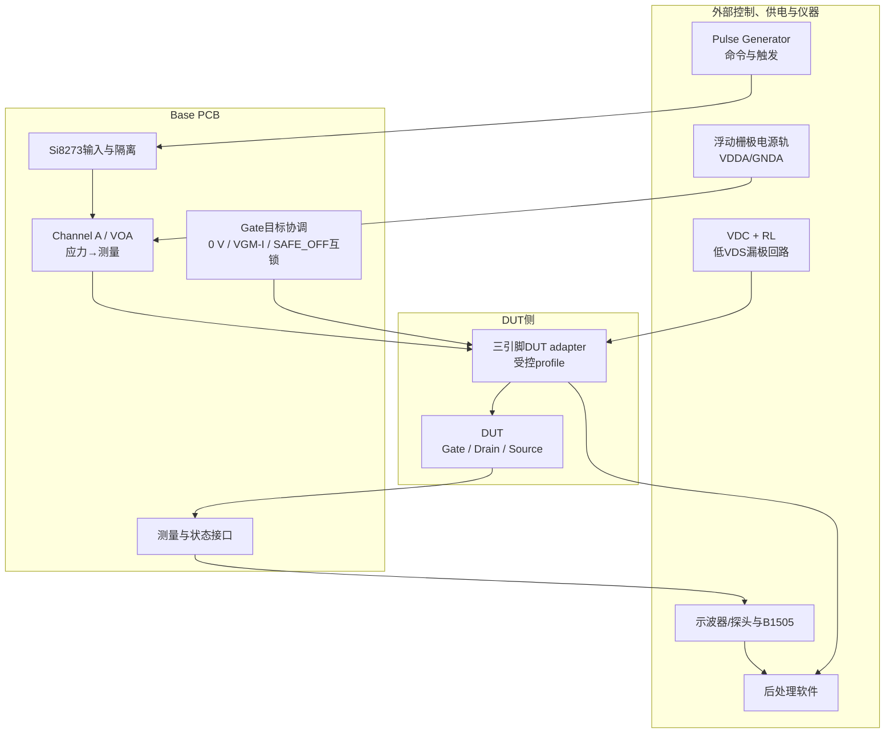
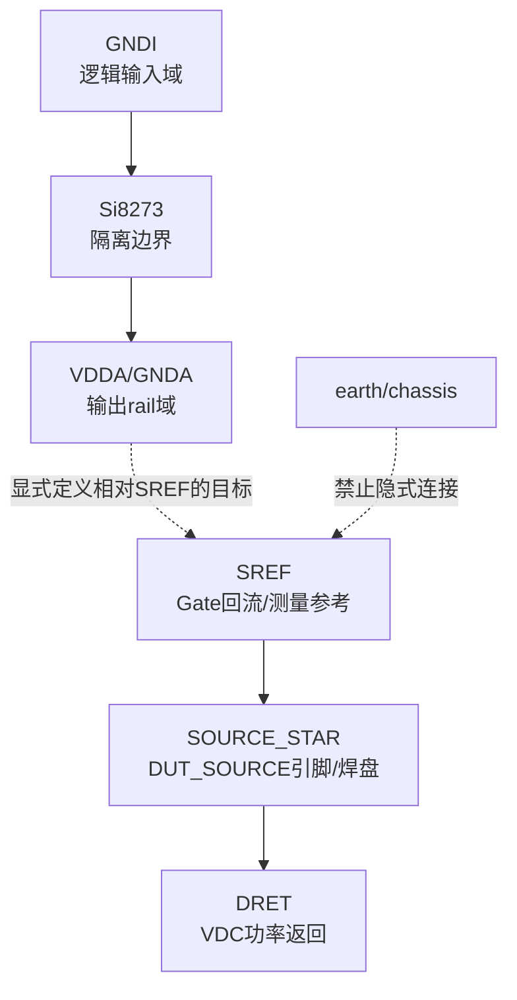
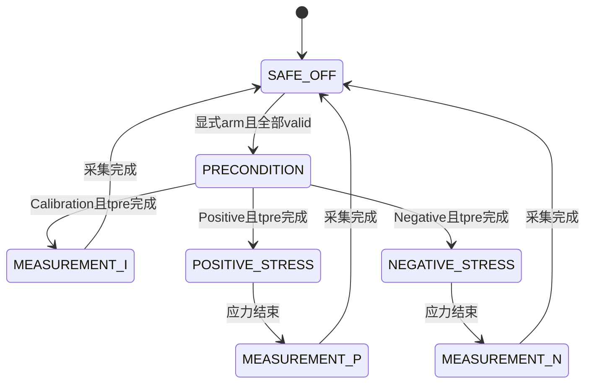
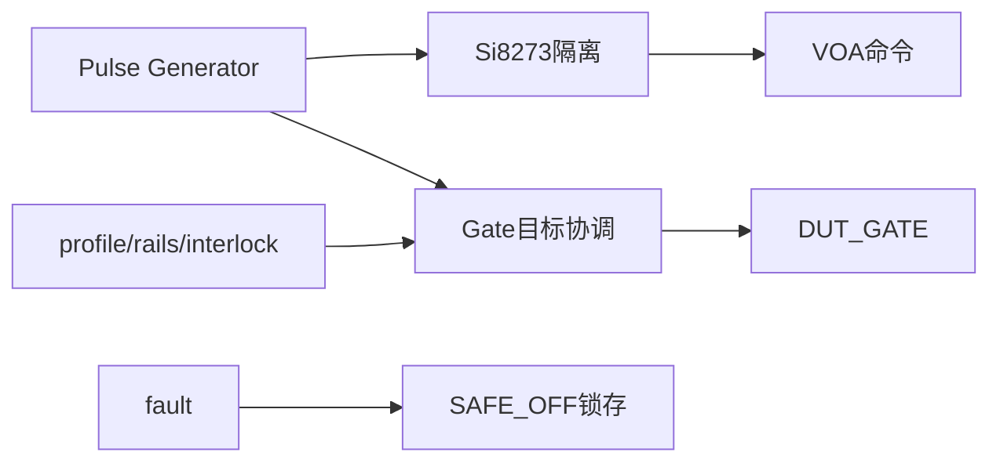
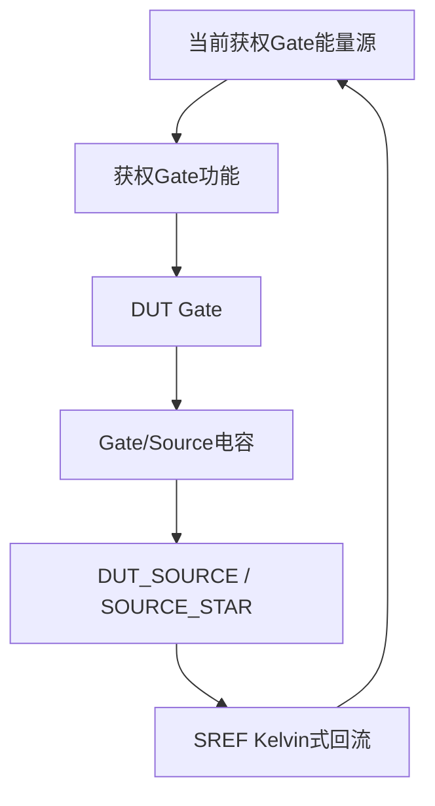
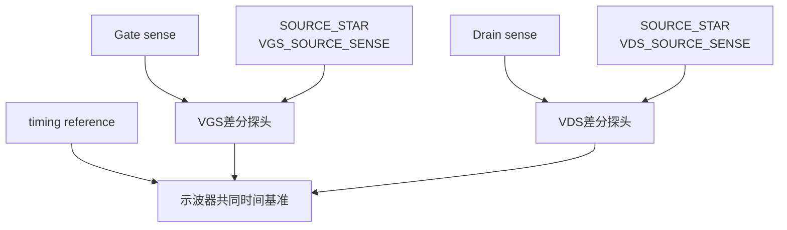
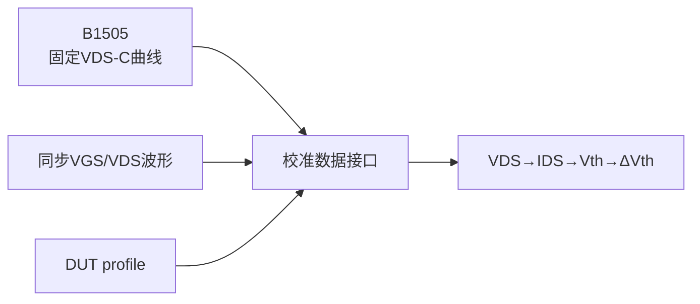

# SiC MOSFET BTI快速栅极驱动PCB / Fig. 3复现

## G1系统架构返修候选基线

- 版本：`G1-SYS-ARCH-v1.1`
- 日期：2026-08-25
- Master审核输入：`CHANGES REQUIRED；G1 ACTIVE`
- 文件状态：**G1 RESOLUTION PROPOSED — READY FOR MASTER REVIEW**
- 需求基线：`docs/requirements.md`，65条`REQ-SYS-*`，状态`FROZEN`
- 阶段状态：G0=`PASS`；G1=`ACTIVE`；G2=`NOT STARTED / 可准备datasheet和计算`；G3=`BLOCKED`

本文件只返修系统架构、逻辑接口、状态时序、职责和风险。未修改冻结需求，未选择器件、数值、connector pinout、具体电路拓扑，也未进入KiCad、BOM、placement、routing或stackup。

## 1. Master批准边界与术语

### 1.1 三引脚DUT边界

当前使用及计划支持的650 V-class与3.3 kV-class SiC MOSFET均为三引脚器件，只有`Gate`、`Drain`、`Source`三个物理引脚。当前G1基线不支持独立第四个Kelvin Source引脚；未来若更换四引脚器件，必须重新执行接口和adapter审核。

### 1.2 Source术语

| 名称 | 受控定义 | 不是 |
|---|---|---|
| `DUT_SOURCE` | 三引脚DUT唯一的Source物理引脚 | 独立Kelvin Source引脚 |
| `SOURCE_STAR` | `DUT_SOURCE`引脚或焊盘处，`SREF`与`DRET`有意单点汇合的位置 | 任意上游地节点 |
| `SREF` | 从`SOURCE_STAR`引出的Kelvin式Gate驱动回流和`VGS`测量参考路径 | 第四个DUT引脚、earth、`GNDA` |
| `DRET` | 从`SOURCE_STAR`引出的`VDC/RL`漏极功率电流返回路径 | 独立电气域、`SREF`的替代测量路径 |

`SREF`与`DRET`不是互相绝缘的电气域；两者在`SOURCE_STAR`有意连接，但承担不同功能。除`SOURCE_STAR`外，不得在更上游再次连接，避免`DRET`路径压降和source bounce进入Gate驱动及`VGS`测量。

三引脚封装内部Source引线的公共电阻和电感位于PCB可分流位置之前，无法由PCB Kelvin式布线完全消除。该限制必须写入每个DUT profile，并在G11通过同步`VGS/VDS`波形与结果重复性验证。

`REQ-SYS-INTERFACE-001`中的“Kelvin Source reference”按三引脚Source端的Kelvin式参考取点执行；`REQ-SYS-INTERFACE-004`按“封装不支持独立Kelvin Source时记录限制”执行。两条冻结需求正文均不修改。

## 2. 完整系统架构

### 图1：完整系统模块方框图

图中DUT只显示三个物理引脚。Base PCB提供通用逻辑接口；adapter将通用接口映射至一个物理Source引脚，并在该引脚或焊盘处形成`SOURCE_STAR`。

## 3. 参考域与Source功能路径

### 3.1 参考域定义

| 参考域或路径 | 定义 | 允许用途 | 禁止默认解释 |
|---|---|---|---|
| `GNDI` | Si8273逻辑输入侧参考 | `VIA`、逻辑供电和控制参考 | `GNDA`、`SREF`、earth |
| `GNDA` | Si8273 channel A输出侧低电源轨 | 输出级低rail；其相对`SREF`电位由profile定义 | 0 V、`SREF`、earth |
| `VDDA` | Si8273 channel A输出侧高电源轨 | 输出级高rail；其相对`SREF`电位由profile定义 | 固定正电压、earth |
| `SREF` | 从`SOURCE_STAR`引出的Kelvin式参考路径 | Gate回流与`VGS`负端参考 | 第四个DUT引脚、earth |
| `DRET` | 从同一`SOURCE_STAR`引出的功率返回功能路径 | `DUT_SOURCE→VDC return` | 与`SREF`隔离的参考域 |
| earth/chassis | 实验室保护地或仪器机壳参考 | 安全、屏蔽及经资格确认的仪器功能 | 任一信号参考的默认节点 |

### 图2：参考域和`SOURCE_STAR`关系图

实线`SREF→SOURCE_STAR→DRET`表示三引脚DUT的有意导电关系，不表示两条PCB路径可任意混用；二次上游连接会形成共阻抗或环路。隔离边界位于`GNDI`与Si8273输出域之间。

### 3.2 Positive/Negative rail逻辑关系

Positive BTI：

- `V(VDDA)-V(SREF)=VGS-P`
- `V(GNDA)-V(SREF)=VGM-P`
- stress：`VIA=HIGH`
- measurement：`VIA=LOW`

Negative BTI：

- `V(VDDA)-V(SREF)=VGM-N`
- `V(GNDA)-V(SREF)=VGS-N`
- stress：`VIA=LOW`
- measurement：`VIA=HIGH`

这些方程只定义逻辑电压关系，不表示`GNDA=SREF`、`GNDA=earth`或`SREF=earth`，也不决定电源实现拓扑。

### 3.3 禁止连接表

| 禁止连接或用法 | 原因与后果 |
|---|---|
| `GNDI↔GNDA` | 跨越隔离边界，形成控制地环路 |
| `GNDI↔SREF` | 控制源可能钳位DUT侧并造成错误`VGS` |
| `GNDA↔SREF`作为默认短接 | 破坏P/N rail逻辑并可能造成rail争用 |
| `GNDA/VDDA↔earth`作为默认连接 | 破坏浮地资格并形成隐藏电流路径 |
| `SREF↔earth` | 使Gate参考失真并可能产生危险接地电流 |
| `SREF↔DRET`在`SOURCE_STAR`以外再次连接 | 功率Source压降和source bounce进入Gate回流与`VGS`测量 |
| 以`DRET`布线替代`SREF`布线 | 失去Kelvin式取点的PCB级收益 |
| 把`SREF`画成第四个DUT pin | 与当前三引脚DUT边界矛盾 |
| 把探头负端视为无影响地 | 可能经机壳、USB/LAN或保护地建立隐式earth路径 |

## 4. 系统模块定义（13个）

| 编号 | 模块 | 输入 | 输出 | 参考 | 责任 | 不负责 | 故障行为 | 后续依赖 | 需求追溯 |
|---:|---|---|---|---|---|---|---|---|---|
| 1 | Pulse Generator / 外部控制 | profile、序列、时序、interlock许可 | `VIA`、状态命令、触发、enable请求 | `GNDI` | 产生可重复命令和共同时间参考 | 不产生gate rail或`VDC` | 撤销enable并请求`SAFE_OFF` | 电平与jitter：G2/G10/G11 | `REQ-SYS-FUNC-003`、`REQ-SYS-FUNC-008`、`REQ-SYS-TIME-003`、`REQ-SYS-TIME-004`、`REQ-SYS-TIME-005`、`REQ-SYS-TIME-006` |
| 2 | Si8273逻辑输入与隔离边界 | `VIA`、`VDDI/GNDI` | 隔离后的channel A命令 | 输入`GNDI`，输出rail域 | 保持隔离并传递命令 | 不定义rail相对`SREF`电位 | 不得产生未授权stress | UVLO/default：G2/G10 | `REQ-SYS-FUNC-007`、`REQ-SYS-FUNC-008`、`REQ-SYS-INTERFACE-003`、`REQ-SYS-INTERFACE-005`、`REQ-SYS-SAFE-002` |
| 3 | Si8273 channel A与快速切换 | 隔离命令、`VDDA/GNDA` | `VOA`两级输出 | 输出rail域，目标相对`SREF` | P/N stress→measurement快速转换 | 不负责0 V、`VGM-I`或B1505 | 禁止保持stress并服从`SAFE_OFF` | 动态与实现：G2/G3/G11 | `REQ-SYS-FUNC-006`、`REQ-SYS-FUNC-007`、`REQ-SYS-FUNC-008`、`REQ-SYS-TIME-001`、`REQ-SYS-TIME-002` |
| 4 | 外部浮动Gate rail模块 | profile、rail enable | `VDDA/GNDA` | 浮动输出域，目标相对`SREF` | 提供profile要求的两条rail | 不借earth闭合回路 | 非浮地、失配或欠压时撤销许可 | 数值、限流、实现：G2/G10 | `REQ-SYS-FUNC-002`、`REQ-SYS-INTERFACE-002`、`REQ-SYS-INTERFACE-003`、`REQ-SYS-INTERFACE-006`、`REQ-SYS-SAFE-004` |
| 5 | Gate目标协调模块 | 状态命令、profile、ready/valid、`SREF` | 0 V目标、`CAL_GATE_TARGET`、路径互斥命令 | `SREF` | 保证PRECONDITION为0 V；在`MEASUREMENT_I`提供`VGM-I`逻辑目标；仲裁Gate路径 | 不选择rail、mux、clamp、器件或拓扑 | 所有目标invalid并移交`SAFE_OFF` | 物理实现：G2/G3；验证：G10/G11 | `REQ-SYS-FUNC-003`、`REQ-SYS-METHOD-001`、`REQ-SYS-INTERFACE-006`、`REQ-SYS-INTERFACE-010` |
| 6 | `SAFE_OFF`与安全控制 | fault、control/rail/profile/interlock valid、user arm | gate inhibit、安全目标、drain disable、fault latch | 跨域逻辑，不合并参考域 | 阻止stress、撤销漏极能量、阻止自动重启 | 不把安全目标固定为具体电压或拓扑 | 锁存`SAFE_OFF`，仅显式re-arm退出 | 阈值/实现：G2/G10 | `REQ-SYS-SAFE-001`、`REQ-SYS-SAFE-002`、`REQ-SYS-SAFE-003`、`REQ-SYS-SAFE-004` |
| 7 | 三引脚DUT Gate/Drain/Source接口 | Gate驱动、`VDC/RL` | 三个物理端口及`SOURCE_STAR` | Gate以`SREF`为参考；功率回流走`DRET` | 只暴露Gate、Drain、Source；在Source端建立两个功能路径 | 不声称有第四个KS pin | 错接或Source路径不完整时禁止arm | pinout/机械：G4/G6；routing：G7 | `REQ-SYS-INTERFACE-001`、`REQ-SYS-INTERFACE-004`、`REQ-SYS-INTERFACE-007`、`REQ-SYS-DUT-004`、`REQ-SYS-DUT-005` |
| 8 | 三引脚DUT adapter与profile | 已批准DUT/profile、通用接口 | 封装映射、`SOURCE_STAR`定义、metadata、configuration-valid | `SREF`与`DRET`在Source端汇合 | 记录封装、`Rg`、公共Source阻抗限制及两条PCB功能路径 | P/N切换中不更换adapter或`Rg`；不支持四引脚器件 | profile/adapter不匹配时禁止arm | 参数：G2；机械/pin：G4/G6 | `REQ-SYS-FUNC-001`、`REQ-SYS-FUNC-002`、`REQ-SYS-DUT-001`、`REQ-SYS-DUT-002`、`REQ-SYS-DUT-003`、`REQ-SYS-DUT-004`、`REQ-SYS-DUT-005` |
| 9 | `VDC + RL`漏极回路 | `VDC`、`RL`、drain enable、DUT | 有限`IDS`与`VDS` | `DRET`从`SOURCE_STAR`回到VDC return | 形成`VDC→RL→Drain→沟道→DUT_SOURCE/SOURCE_STAR→DRET→return` | 不借`SREF`布线承载功率电流 | fault时撤销漏极供能 | 数值/额定/限流：G2/G10/G11 | `REQ-SYS-FUNC-004`、`REQ-SYS-FUNC-005`、`REQ-SYS-METHOD-004`、`REQ-SYS-METHOD-005`、`REQ-SYS-METHOD-006`、`REQ-SYS-METHOD-007`、`REQ-SYS-METHOD-008`、`REQ-SYS-SAFE-003` |
| 10 | `VGS/VDS/timing`测量接口 | Gate、Drain、`SOURCE_STAR`的独立sense支路及trigger | 同次事件`VGS(t)`、`VDS(t)`、时序参考 | 两种电压负端均取Source端局部sense；`VGS`支路属于`SREF` | 提供受控差分观察点；显式管理公共Source阻抗限制 | 不把两个sense支路合成第四个DUT pin | 探头不合格或建earth路径时禁止测试 | 仪器：G2；接入：G6/G7；资格：G10/G11 | `REQ-SYS-MEAS-001`、`REQ-SYS-MEAS-002`、`REQ-SYS-MEAS-003`、`REQ-SYS-INTERFACE-009`、`REQ-SYS-VERIFY-001` |
| 11 | B1505固定`VDS-C`校准 | DUT、温度、扫描配置、`Ith` | `IDS-VGS`曲线、initial `Vth`、metadata | B1505仪器域 | 生成慢扫校准数据 | 不承担约100 ns切换 | 配置不一致则数据invalid | 配置与数据格式：G2/G12 | `REQ-SYS-METHOD-003`、`REQ-SYS-METHOD-004`、`REQ-SYS-METHOD-005`、`REQ-SYS-MEAS-006`、`REQ-SYS-MEAS-007`、`REQ-SYS-MEAS-008`、`REQ-SYS-MEAS-009` |
| 12 | 波形与后处理软件 | 波形、`VDC/RL`、B1505曲线、profile | MI/MP/MN、`IDS`、`Vth`、`ΔVth`及报告 | 数据域 | 保存原始数据并实现可审计计算链 | 不控制实时安全 | 条件失效时标记invalid | 算法/容差：G10/G11/G12 | `REQ-SYS-MEAS-004`、`REQ-SYS-MEAS-005`、`REQ-SYS-MEAS-006`、`REQ-SYS-MEAS-007`、`REQ-SYS-MEAS-009`、`REQ-SYS-VERIFY-002`、`REQ-SYS-VERIFY-003`、`REQ-SYS-VERIFY-004` |
| 13 | 上电、掉电、interlock与保护协调 | user arm、所有valid和fault | gate/drain enable、shutdown顺序、fault记录 | 跨域控制 | 编排时序并分配检测/切断责任 | 不选择保护器件、setpoint或delay | fault优先，去能量并锁存 | 实现与故障注入：G2/G10 | `REQ-SYS-SAFE-001`、`REQ-SYS-SAFE-002`、`REQ-SYS-SAFE-003`、`REQ-SYS-SAFE-004` |

## 5. 状态逻辑与时序

### 图3：七状态转换图

任一非`SAFE_OFF`状态出现fault、control loss、rail invalid、profile invalid、interlock invalid或测量条件失效，都立即使数据无效并进入`SAFE_OFF`。图中省略的这些故障返回路径对所有状态均成立；fault后不得自动重新进入测试序列。

### 5.1 PRECONDITION建立和`tpre`起算顺序

1. profile、control、rails和interlock全部有效；
2. Gate进入相对`SREF`的0 V目标；
3. 验证0 V Gate目标有效；
4. 允许`VDC/RL`供能；
5. 验证`VDS=VDC`及漏极回路状态有效；
6. 只有上述条件持续成立后才开始计算`tpre`；
7. 任一条件失效，当前数据立即无效并进入`SAFE_OFF`；
8. fault清除后仍须显式reset/re-arm并从步骤1重新开始。

因此，进入`PRECONDITION`状态不等于`tpre`已经开始；在`VDS=VDC`尚未建立时，PRECONDITION计时无效。

### 5.2 七状态统一表

| 状态 | 目的 | Gate目标（相对`SREF`） | Drain目标 | `VIA` | Gate路径 | 数据有效性 | 进入条件 | 退出条件 | 故障处理 |
|---|---|---|---|---|---|---|---|---|---|
| `SAFE_OFF` | 安全待机/故障锁存 | 符号化非应力目标 | disabled并去能量 | 不得产生stress | 仅安全功能获权 | 无效 | 上电、stop或任一fault | 显式reset/re-arm且全部valid | 保持锁存 |
| `PRECONDITION` | 建立可计时初始状态 | 0 V | 先disabled；0 V有效后enable并验证`VDS=VDC` | 屏蔽/不参与驱动 | 0 V路径独占 | 仅条件验证；不是MI/MP/MN | arm与profile/control/rails/interlock有效 | 全条件有效且`tpre`完成 | 数据无效并`SAFE_OFF` |
| `MEASUREMENT_I` | 获得MI/`Vth-IS` | `VGM-I` | 低`VDS`测量回路有效 | 由P/N真值表之外的Calibration命令协调，不作为rail绑定 | `CAL_GATE_TARGET`独占 | 条件满足时MI有效 | Calibration、`tpre`完成、接口ready/valid | `tmea`/采集完成 | 数据无效并`SAFE_OFF` |
| `POSITIVE_STRESS` | 正应力 | `VGS-P` | `VDC/RL`有效 | HIGH | `VOA`独占 | 不作为测量点 | Positive且`tpre`完成 | `tstr`结束 | 数据无效并`SAFE_OFF` |
| `MEASUREMENT_P` | 获得MP | `VGM-P` | 低`VDS`测量回路有效 | LOW | `VOA`独占 | 条件满足时MP有效 | 正应力结束且break-before-make满足 | `tmea`/采集完成 | 数据无效并`SAFE_OFF` |
| `NEGATIVE_STRESS` | 负应力 | `VGS-N` | `VDC/RL`有效 | LOW | `VOA`独占 | 不作为测量点 | Negative且`tpre`完成 | `tstr`结束 | 数据无效并`SAFE_OFF` |
| `MEASUREMENT_N` | 获得MN | `VGM-N` | 低`VDS`测量回路有效 | HIGH | `VOA`独占 | 条件满足时MN有效 | 负应力结束且break-before-make满足 | `tmea`/采集完成 | 数据无效并`SAFE_OFF` |

`PRECONDITION`与`SAFE_OFF`即使未来可能采用相同数值，也不等价：前者是经验证后才起算的实验状态并要求`VDS=VDC`；后者撤销漏极能量、数据无效并锁存故障。

### 5.3 Positive BTI真值表

| 状态 | rail关系 | `VIA` | Gate目标 | 下一状态 |
|---|---|---|---|---|
| `PRECONDITION` | P rails可建立但不得与0 V路径争用 | 屏蔽 | 0 V | `POSITIVE_STRESS` |
| `POSITIVE_STRESS` | `VDDA-SREF=VGS-P`；`GNDA-SREF=VGM-P` | HIGH | `VGS-P` | `MEASUREMENT_P` |
| `MEASUREMENT_P` | 同上 | LOW | `VGM-P` | `SAFE_OFF` |

### 5.4 Negative BTI真值表

| 状态 | rail关系 | `VIA` | Gate目标 | 下一状态 |
|---|---|---|---|---|
| `PRECONDITION` | N rails可建立但不得与0 V路径争用 | 屏蔽 | 0 V | `NEGATIVE_STRESS` |
| `NEGATIVE_STRESS` | `VDDA-SREF=VGM-N`；`GNDA-SREF=VGS-N` | LOW | `VGS-N` | `MEASUREMENT_N` |
| `MEASUREMENT_N` | 同上 | HIGH | `VGM-N` | `SAFE_OFF` |

### 5.5 Calibration控制表

| 项目 | 受控定义 |
|---|---|
| 命令语义 | `STATE_COMMAND=CALIBRATION`请求先完成有效PRECONDITION，再进入`MEASUREMENT_I` |
| 逻辑提供者 | 模块5 Gate目标协调模块 |
| 正式接口 | `IF-GATE-01 / CAL_GATE_TARGET` |
| sink/reference | sink=`DUT_GATE`；reference=`SREF` |
| 正常目标 | `V(DUT_GATE)-V(SREF)=VGM-I` |
| ready条件 | profile/control/rails/interlock有效；Calibration命令有效；0 V路径可释放；其他Gate路径可互斥 |
| valid条件 | 目标已被接受且Gate目标验证有效；漏极回路与采集条件有效时MI才可标记有效 |
| 互斥 | 0 V PRECONDITION路径、`VOA` P/N驱动路径、`CAL_GATE_TARGET`和`SAFE_OFF` Gate功能任一时刻最多一个获权 |
| `SAFE_OFF` | Calibration命令和valid立即撤销；Gate移交安全目标；drain disabled；fault锁存 |
| 实现延期 | `VGM-I`具体rail、mux、clamp、器件和拓扑由G2/G3决定 |
| 需求追溯 | `REQ-SYS-FUNC-003`、`REQ-SYS-METHOD-001`、`REQ-SYS-METHOD-002`、`REQ-SYS-INTERFACE-006`、`REQ-SYS-INTERFACE-010`、`REQ-SYS-SAFE-001` |

禁止组合包括：两个Gate目标路径同时获权；0 V路径与`VOA`争用；Calibration目标与任一P/N stress目标同时valid；profile或interlock invalid时drain enable；fault后自动重启；未经资格确认的earth-referenced probe连接。所有Gate路径转换都必须满足功能级break-before-make，G1不选择实现拓扑。

## 6. 关键控制、电流与测量路径

### 图4：控制与安全路径

### 图5：Gate充放电与回流路径

Gate充电和放电方向相反，但都必须使用`SREF`功能路径闭合，不得借`DRET`上游功率布线返回。三引脚封装内部公共Source阻抗仍在回路内，是已记录限制。

### 图6：漏极功率电流路径

### 图7：`VGS/VDS`测量路径

两个Source sense名称表示从同一物理Source端引出的不同测量功能支路，不表示两个Source引脚。它们的物理落点和探头接入由G6/G7定义，公共Source阻抗误差由G11验证。

### 图8：B1505校准与数据路径

关键回路说明：

1. 逻辑输入电流返回`GNDI`，不经`GNDA/SREF/earth`。
2. Si8273输出侧供电电流在受控浮动rail域内闭合，rail相对`SREF`的关系必须显式定义。
3. Gate充放电流均经`DUT_SOURCE/SOURCE_STAR→SREF`返回。
4. 0 V预处理必须建立Gate-to-`SREF`的受控回路并与其他Gate路径互斥。
5. 漏极电流严格为`VDC→RL→DUT_DRAIN→DUT沟道→DUT_SOURCE/SOURCE_STAR→DRET→VDC return`。
6. `VGS`差分测量为Gate到Source端Kelvin式sense；`VDS`差分测量为Drain到Source端局部sense。
7. `SREF`不能由`DRET`上游功率回路取代，因为其压降和source bounce会进入`VGS`解释。
8. 示波器earth连接在仪器资格确认前保持受控，不能成为`SREF/GNDA`的隐式连接。

## 7. 接口控制文档（25个逻辑接口）

| 接口ID | 名称 | Source模块 | Sink模块 | 类型/方向 | 参考 | 正常含义 | `SAFE_OFF`含义 | 可配置项 | 后续Gate | 需求追溯 |
|---|---|---|---|---|---|---|---|---|---|---|
| IF-CTRL-01 | `VIA` | Pulse Generator | Si8273输入 | 控制→ | `GNDI` | 执行P/N真值 | 不得产生stress | 电平/时序 | G2/G10/G11 | `REQ-SYS-FUNC-007`、`REQ-SYS-FUNC-008`、`REQ-SYS-INTERFACE-005` |
| IF-CTRL-02 | `TRIGGER_TIMING_REF` | Pulse Generator | 示波器/软件 | 时序→ | 接收端资格确认 | 建立共同时间关系 | 仅fault/stop记录 | 电平/jitter | G2/G10/G11 | `REQ-SYS-TIME-002`、`REQ-SYS-MEAS-001`、`REQ-SYS-VERIFY-001` |
| IF-CTRL-03 | `STATE_COMMAND` | Sequence controller | 协调/安全模块 | 控制→ | `GNDI`/隔离状态域 | 选择Calibration/P/N和状态 | 仅允许stop/reset/re-arm | 序列/时序 | G10/G12 | `REQ-SYS-FUNC-003`、`REQ-SYS-TIME-003`、`REQ-SYS-TIME-004`、`REQ-SYS-TIME-005`、`REQ-SYS-TIME-006` |
| IF-PWR-I-01 | `VDDI_GNDI` | 逻辑电源 | Si8273输入侧 | 能量↔ | `GNDI` | 逻辑侧供电 | 未ready不得arm | 额定/去耦 | G2/G3/G10 | `REQ-SYS-INTERFACE-003`、`REQ-SYS-SAFE-002` |
| IF-PWR-A-01 | `VDDA_GNDA` | 浮动rail | Si8273输出侧 | 能量↔ | 输出rail域 | 提供当前profile rail | disabled/非应力 | 数值/限流 | G2/G3/G10 | `REQ-SYS-FUNC-002`、`REQ-SYS-INTERFACE-006`、`REQ-SYS-SAFE-004` |
| IF-PWR-A-02 | `RAIL_SREF_PROFILE` | profile/`SREF`接口 | 浮动rail | 目标/参考↔ | `SREF`边界 | 定义rail相对`SREF`目标 | 不借earth闭合 | 实现/共模 | G2/G3/G10 | `REQ-SYS-INTERFACE-001`、`REQ-SYS-INTERFACE-002`、`REQ-SYS-INTERFACE-003`、`REQ-SYS-INTERFACE-006` |
| IF-DRV-01 | `VOA` | Si8273 channel A | `Rg`/DUT Gate接口 | Gate能量↔ | 相对`SREF` | P/N stress→measurement | inhibited | 动态能力 | G2/G3/G11 | `REQ-SYS-FUNC-006`、`REQ-SYS-FUNC-007`、`REQ-SYS-TIME-001`、`REQ-SYS-TIME-002` |
| IF-GATE-01 | `CAL_GATE_TARGET` | 模块5 Gate目标协调模块 | `DUT_GATE` | 逻辑目标→ | `SREF` | `MEASUREMENT_I`保证`VGS=VGM-I` | invalid并移交安全目标 | 仅符号目标/profile；物理实现延期 | G2/G3/G10/G11 | `REQ-SYS-FUNC-003`、`REQ-SYS-METHOD-001`、`REQ-SYS-METHOD-002`、`REQ-SYS-INTERFACE-006`、`REQ-SYS-INTERFACE-010`、`REQ-SYS-SAFE-001` |
| IF-DUT-01 | `DUT_GATE` | 获权Gate功能 | DUT Gate | Gate能量↔ | `SREF` | 承载当前Gate目标 | 安全目标 | `Rg`/profile | G2/G4/G6/G7 | `REQ-SYS-METHOD-001`、`REQ-SYS-METHOD-002`、`REQ-SYS-DUT-005` |
| IF-DUT-02 | `DUT_SOURCE_SREF` | `DUT_SOURCE/SOURCE_STAR` | driver与`VGS`测量 | 参考/低电流回流↔ | `SREF` | 三引脚Source端Kelvin式参考路径 | 保持受控且不接earth | 落点/寄生 | G4/G6/G7/G11 | `REQ-SYS-INTERFACE-001`、`REQ-SYS-INTERFACE-002`、`REQ-SYS-INTERFACE-004`、`REQ-SYS-MEAS-002` |
| IF-DUT-03 | `DUT_SOURCE_POWER_RETURN` | `DUT_SOURCE/SOURCE_STAR` | `DRET/VDC return` | 功率电流→ | `DRET`功能路径 | 漏极功率回流 | drain去能量 | 额定/寄生 | G2/G4/G6/G7/G11 | `REQ-SYS-FUNC-004`、`REQ-SYS-INTERFACE-004`、`REQ-SYS-INTERFACE-007` |
| IF-DUT-04 | `DUT_DRAIN` | `RL` | DUT Drain | 功率电流→ | 漏极回路 | 接收低能量电流 | de-energized | profile | G2/G4 | `REQ-SYS-FUNC-004`、`REQ-SYS-INTERFACE-007` |
| IF-DRAIN-01 | `VDC` | 漏极电源 | `RL` | 能量→ | `DRET`回流 | 提供DUT专用低`VDS`偏置 | disabled | 数值/限流 | G2/G10 | `REQ-SYS-METHOD-003`、`REQ-SYS-METHOD-004`、`REQ-SYS-METHOD-005`、`REQ-SYS-INTERFACE-007`、`REQ-SYS-SAFE-003`、`REQ-SYS-SAFE-004` |
| IF-DRAIN-02 | `RL` | 负载模块 | DUT Drain | 能量→ | `DRET`回流 | 限流并支持`IDS`计算 | 回路disabled | 数值/寄生 | G2/G6/G7 | `REQ-SYS-FUNC-004`、`REQ-SYS-FUNC-005`、`REQ-SYS-MEAS-004` |
| IF-MEAS-01 | `VGS_GATE_SENSE` | DUT Gate | `VGS`探头 | 测量→ | 与Source sense成对 | `VGS`正端 | 数据无效 | 探头负载 | G2/G6/G7/G10 | `REQ-SYS-MEAS-001`、`REQ-SYS-MEAS-002`、`REQ-SYS-MEAS-003`、`REQ-SYS-INTERFACE-009` |
| IF-MEAS-02 | `VGS_SOURCE_SENSE` | `SOURCE_STAR`局部sense支路 | `VGS`探头 | 测量→ | `SREF` | `VGS`负端 | 不接earth，数据无效 | 落点/探头 | G2/G6/G7/G10/G11 | `REQ-SYS-MEAS-001`、`REQ-SYS-MEAS-002`、`REQ-SYS-MEAS-003`、`REQ-SYS-INTERFACE-009` |
| IF-MEAS-03 | `VDS_DRAIN_SENSE` | DUT Drain局部sense | `VDS`探头 | 测量→ | 与Source sense成对 | `VDS`正端 | 仅确认去能量 | 共模/带宽 | G2/G6/G7/G10 | `REQ-SYS-MEAS-001`、`REQ-SYS-MEAS-003`、`REQ-SYS-INTERFACE-009` |
| IF-MEAS-04 | `VDS_SOURCE_SENSE` | `SOURCE_STAR`局部sense支路 | `VDS`探头 | 测量→ | Source局部参考 | `VDS`负端 | 数据无效 | 落点/探头 | G2/G6/G7/G10/G11 | `REQ-SYS-MEAS-001`、`REQ-SYS-MEAS-003`、`REQ-SYS-INTERFACE-004`、`REQ-SYS-INTERFACE-009`、`REQ-SYS-VERIFY-001` |
| IF-DATA-01 | `WAVEFORM_DATA` | 示波器 | 软件 | 数据→ | 数据域 | 同次事件波形与时序 | 标记invalid/fault | 格式/采样 | G10/G11/G12 | `REQ-SYS-MEAS-001`、`REQ-SYS-MEAS-009`、`REQ-SYS-VERIFY-001` |
| IF-DATA-02 | `B1505_CAL_DATA` | B1505 | 软件 | 数据→ | 数据域 | 固定`VDS-C`曲线、`Ith`和metadata | 不使用不匹配数据 | 格式/插值 | G12 | `REQ-SYS-INTERFACE-008`、`REQ-SYS-MEAS-006`、`REQ-SYS-MEAS-007`、`REQ-SYS-MEAS-008`、`REQ-SYS-MEAS-009` |
| IF-DATA-03 | `RESULT_DATA` | 软件 | 报告/存储 | 数据→ | 数据域 | `IDS/Vth/ΔVth`与审计链 | 不发布合格结论 | 算法版本 | G12 | `REQ-SYS-MEAS-004`、`REQ-SYS-MEAS-005`、`REQ-SYS-MEAS-006`、`REQ-SYS-MEAS-007`、`REQ-SYS-MEAS-009`、`REQ-SYS-VERIFY-004` |
| IF-SAFE-01 | `PROTECTION_INTERLOCK_STATUS` | 检测者/用户 | 安全协调 | 状态→ | 各源域/隔离接口 | 组合valid/fault | fault优先并锁存 | 阈值延期 | G2/G10 | `REQ-SYS-SAFE-001`、`REQ-SYS-SAFE-002`、`REQ-SYS-SAFE-003`、`REQ-SYS-SAFE-004` |
| IF-SAFE-02 | `GATE_POWER_ENABLE_DISABLE` | 安全协调 | rails/driver/Gate协调 | 控制→ | 隔离控制域 | 顺序允许Gate功能 | inhibit | 极性/default | G2/G10 | `REQ-SYS-SAFE-001`、`REQ-SYS-SAFE-002` |
| IF-SAFE-03 | `DRAIN_POWER_ENABLE_DISABLE` | 安全协调 | `VDC/RL` | 控制→ | 隔离控制域 | 仅在Gate和PRECONDITION条件有效后供能 | disable/去能量 | 极性/default | G2/G10 | `REQ-SYS-SAFE-001`、`REQ-SYS-SAFE-002`、`REQ-SYS-SAFE-003` |
| IF-PROFILE-01 | `DUT_PROFILE_CONFIG` | 受控配置 | 控制/rails/adapter/软件 | 配置→ | 数据/配置域 | 提供DUT与实验约束，包括三引脚公共Source限制 | invalid禁止arm | DUT专用字段 | G2/G4/G10/G12 | `REQ-SYS-DUT-001`、`REQ-SYS-DUT-002`、`REQ-SYS-DUT-003`、`REQ-SYS-DUT-004`、`REQ-SYS-DUT-005`、`REQ-SYS-SAFE-004` |

接口ID总数重新计算为25，全部唯一；新增项为`IF-GATE-01`，原24接口未机械沿用旧总数。每个接口均追溯到现有canonical `REQ-SYS-*`。

## 8. `OI-012...017`返修提案

以下六项状态均为：**G1 RESOLUTION PROPOSED — READY FOR MASTER REVIEW**，不表示Master已批准或关闭。

### `OI-012`：`SAFE_OFF`

`SAFE_OFF`负责禁止stress、撤销drain enable、使Gate进入符号化非应力目标并锁存fault；PRECONDITION负责0 V实验初态、`VDS=VDC`验证和`tpre`。fault、control loss、UVLO、rail/profile/interlock invalid或用户emergency stop强制进入`SAFE_OFF`。退出需要故障清除、全部valid及显式reset/re-arm；不允许自动恢复。具体电压、器件和拓扑延期至G2/G3，故障验证在G10。

### `OI-013`：上电、掉电、失控、UVLO与default

正常顺序：`SAFE_OFF`初始化→逻辑侧上电→输出rail建立并验证→控制/profile/interlock有效→Gate 0 V建立并验证→允许`VDC/RL`→验证`VDS=VDC`→开始`tpre`→执行序列。正常关断先停止序列和标记数据结束，再撤销drain能量，最后按安全顺序撤销Gate功能/rail。control loss、UVLO或emergency shutdown立即使数据无效、撤销drain能量并锁存`SAFE_OFF`。阈值和delay延期至G2/G10。

### `OI-014`：保护、争用与能量责任

- Gate过压：Base PCB观察接口与外部仪器检测链共同提供证据；安全协调撤销Gate许可。
- Drain current/energy：`VDC/RL`模块限制；安全协调撤销drain enable；用户批准最终接线和上电。
- 0 V/`VOA`/`CAL_GATE_TARGET`争用：Gate目标协调模块实施功能级互斥。
- False trigger：Pulse Generator保证命令完整性；安全协调将非法组合转入`SAFE_OFF`。
- Fault记录：示波器保存波形，软件关联metadata和invalid原因。

只分配功能责任，不选择保护拓扑或setpoint。

### `OI-015`：650 V/3.3 kV兼容架构

| 项目 | 650 V-class | 3.3 kV-class | 属性 |
|---|---|---|---|
| Base PCB与七状态 | 同一逻辑架构 | 同一逻辑架构 | 通用 |
| Gate/`SREF`概念 | 三引脚Source端Kelvin式取点 | 三引脚Source端Kelvin式取点 | 通用 |
| DUT物理引脚 | Gate/Drain/Source | Gate/Drain/Source | 共同边界 |
| `SOURCE_STAR` | Source引脚/焊盘 | Source引脚/焊盘 | 通用原则，物理实现DUT专用 |
| 公共Source阻抗 | profile记录并G11验证 | profile记录并G11验证 | DUT专用限制 |
| adapter/封装 | DUT专用 | DUT专用 | DUT专用 |
| `Qg/Ciss/Crss`、Gate levels、`Rg` | profile确定 | profile确定 | DUT专用 |
| `VDS-C/VDC/RL` | profile确定 | profile确定 | DUT专用 |
| 探头、共模与带宽 | 资格确认 | 资格确认 | DUT/条件专用 |
| 测量链 | `VDS→IDS→Vth→ΔVth` | 同一计算链 | 通用 |

本项目不施加650 V或3.3 kV额定阻断电压，不是breakdown test。

### `OI-016`：三引脚DUT connector/adapter策略

Base PCB必须提供`DUT_GATE`、`DUT_DRAIN`、`DUT_SOURCE_SREF`、`DUT_SOURCE_POWER_RETURN`和成对sense逻辑接口。Adapter属于DUT profile，负责将两条Source功能路径映射到同一`DUT_SOURCE/SOURCE_STAR`，并记录三引脚公共Source阻抗限制。所有当前profile均按三引脚边界建立，不再提供独立Source参考引脚的可选架构。不同封装的机械、pinout和落点延期至G4/G6；同一DUT/profile的P/N切换中不得更换adapter。未来四引脚Kelvin Source器件必须重新进行接口和adapter审核，不属于本候选基线。

### `OI-017`：DUT专用`Rg`

`Rg`属于DUT-specific configuration；同一DUT/profile进行P/N切换时不得改变，更换已批准DUT/profile时才可按批准策略改变。具体阻值由G2根据`Qg`、驱动电流、速度、过冲和振铃计算，物理实现由后续Gate批准。

## 9. PCB与外部系统责任矩阵

图例：R=执行责任；A=最终批准；S=支持/提供输入；—=不承担。

| 功能 | Base PCB | DUT adapter | Pulse Generator | 外部rails | `VDC/RL` | 示波器/探头 | B1505 | 软件 | User |
|---|---:|---:|---:|---:|---:|---:|---:|---:|---:|
| 状态命令与trigger | S | — | R | — | — | S | — | S | A |
| 隔离与P/N快速切换 | R | S | S | S | — | S | — | — | A |
| 0 V与Calibration Gate目标互斥 | R | S | S | S | — | S | — | — | A |
| `SAFE_OFF`协调 | R | S | S | S | S | S | — | S | A |
| Gate rails | S | — | S | R | — | S | — | — | A |
| Source端两功能路径 | S | R | — | S | S | S | — | — | A |
| Drain能量与限流 | S | S | S | — | R | S | — | — | A |
| `VGS/VDS`采集 | S | S | S | — | S | R | — | S | A |
| 固定`VDS-C`校准曲线 | — | S | — | — | — | — | R | S | A |
| `IDS/Vth/ΔVth`计算 | — | — | — | — | S | S | S | R | A |
| metadata/fault关联 | S | S | S | S | S | S | S | R | A |
| 最终接线和上电批准 | S | S | S | S | S | S | S | S | A |

## 10. G1架构级风险与简化FMEA

| 失效模式 | 原因 | 后果 | 检测责任 | 安全动作责任 | G1控制 | 后续验证Gate |
|---|---|---|---|---|---|---|
| `SREF`意外接earth | 探头/电源/机壳隐藏连接 | 短路、错误`VGS`、设备损坏 | User+仪器资格确认 | User+安全协调 | 禁止隐式连接 | G2/G10 |
| 外部rail不浮地 | 电源输出或通信口接earth | rail争用、错误Gate电压 | rail模块+User | 安全协调撤销Gate许可 | rail-valid前不得arm | G2/G10 |
| Negative默认状态持续负应力 | polarity/default错误 | 非计划BTI | Pulse Generator+安全协调 | `SAFE_OFF`锁存 | default不授权stress | G2/G10 |
| 0 V路径与`VOA`/`CAL_GATE_TARGET`争用 | 仲裁或时序错误 | 大电流、器件损坏 | Gate目标协调 | Gate disable | 单一获权与break-before-make | G2/G10 |
| Gate过冲/振铃 | 寄生与驱动不匹配 | 超额定或错误应力 | 示波器+软件 | 安全协调/User | profile约束与观察接口 | G2/G11 |
| `VDS`测量链过慢 | 带宽、负载、deskew不足 | `tdly`和MI/MP/MN错误 | 示波器+软件 | 数据invalid | 同次事件接口 | G2/G10/G11 |
| 三引脚公共Source阻抗 | 封装内部Source电阻/电感不可分离 | source bounce同时污染实际Gate电压和测量解释 | profile审查+示波器+软件 | 数据invalid/停止测试 | `SOURCE_STAR`、SREF/DRET分流、限制登记 | G4/G6/G7/G11 |
| `SREF/DRET`上游二次连接 | 布线或仪器造成环路 | 功率压降进入Gate参考 | 设计审查+连通性检查 | 禁止arm | 只允许`SOURCE_STAR`汇合 | G3/G7/G10 |
| `VDC/RL`自热 | 电流/占空比/能量超限 | 温度漂移或DUT损伤 | `VDC/RL`模块+User | 撤销drain能量 | 能量责任分配 | G2/G10/G11 |
| False trigger/control loss | 噪声、线缆或源故障 | 非计划状态或长应力 | Pulse Generator+安全协调 | 锁存`SAFE_OFF` | 命令valid与fault优先 | G2/G10 |
| UVLO | 逻辑或输出rail跌落 | 输出默认状态不确定 | 驱动/rail状态接口 | `SAFE_OFF` | 未ready不得arm | G2/G10 |
| Adapter接错 | 封装、pin或方向错误 | 短路、错误Source参考 | User+profile检查 | 禁止arm | adapter/profile一致性 | G4/G10 |
| 两类DUT profile混用 | metadata或配置选择错误 | Gate/drain条件超限 | 软件+User | 禁止arm/数据invalid | profile checksum/身份逻辑待后续 | G2/G10/G12 |
| Source sense落点错误 | sense从`DRET`上游取点 | `VGS/VDS`包含额外压降 | G6/G7设计审查 | 数据invalid | 接口固定为`SOURCE_STAR`局部sense | G6/G7/G11 |

本FMEA共14项，不编造发生率、严重度或定量风险等级。所有风险保持开放，直至对应验证完成。

## 11. 延期项与返修结论

| 延期内容 | Owner/Gate |
|---|---|
| `VGM-I`具体rail、mux、clamp、器件与物理拓扑 | G2/G3，Master批准 |
| `SOURCE_STAR`焊盘实现、sense落点、机械与pinout | G4/G6/G7 |
| 三引脚封装公共Source阻抗的动态影响 | G11 |
| rail范围、`Rg`、保护阈值、探头与带宽 | G2/G10/G11 |
| 数据算法、容差和最终发布规则 | G12 |

本候选基线定义13个模块、7个状态、25个唯一逻辑接口、8幅Mermaid图、14项FMEA及完整责任矩阵。所有DUT图均只有Gate、Drain、Source三个物理引脚；`SREF`与`DRET`仅在`SOURCE_STAR`有意汇合；`MEASUREMENT_I`的`VGM-I`逻辑提供者和接口已经明确。SP2/SP3可据此继续架构输入准备，但G3仍保持`BLOCKED`，直到Master批准G1。

# G1 STATUS: READY FOR MASTER REVIEW；G1 ACTIVE

> 该状态只表示G1返修候选基线具备Master复审条件，不表示G1已经PASS或FROZEN，不表示接口已经FROZEN，不批准任何G2参数或G3电路。
